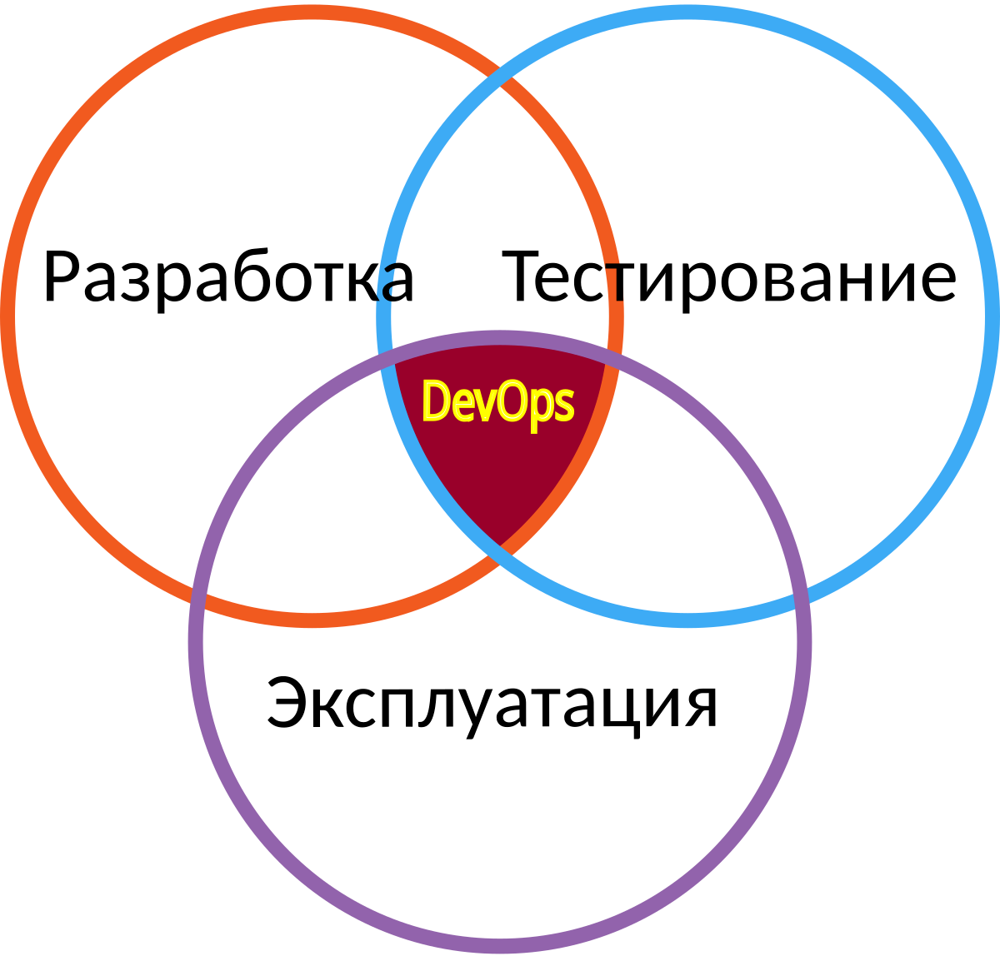

# Введение

Добро пожаловать на курс, посвященный изучению современных IT-практик и технологий, которые лежат в основе такого популярного подхода, как DevOps. Данный курс создан для того, чтобы погрузиться в мир, где разработка программного обеспечения и IT-операции взаимодействуют гармонично и эффективно, создавая более качественные и востребованные продукты. Курс ориентирован на людей, только начинающих свой путь в сфере инфомационных технологий.

## О курсе

Цель данного курса заключается не только в понимании методологий devops, но и в обучении внедрению методологий в продуктовые рабочие процессы. DevOps — не просто набор инструментов или технологий. Это философия и культура взаимодействия между командами разработчиков и IT-операторов. В условиях стремительно развивающегося мира технологий компании сталкиваются с необходимостью ускорения выпуска продуктов и повышения их качества. DevOps обеспечивает все необходимые условия для достижения этой цели посредством автоматизации, улучшения процессов и внедрения непрерывной интеграции и поставки.

## Знакомство

Курс рассчитан на то, что у каждого из слушателей свой уровень подготовки и свои ожидания. Поэтому курс написан таким образом, чтобы все было понятно, вне зависимости от начального уровня. Неважно, являетесь ли вы студентом, только начинающим карьеру в IT, или профессионалом, решившим расширить свои горизонты, курс подойдет как начинающим, так и опытным специалистам.

На этом курсе вас ожидают интересные и познавательные лекции, практические задания, обсуждения и проектная работа.

## Оглавление

1. Введение в DevOps: В первой части курса рассмотрено общее представление о том, что такое DevOps, его история, ключевые принципы и как он изменяет облик современных IT-команд. Это не просто технологии: это изменение культуры и подхода к работе.

2. Изучение Linux: Linux — один из основных инструментов в арсенале DevOps-инженера. В данное главе рассказывается о основных концепциях и особенностях операционной системы Linux, чтобы вы чувствовали себя уверенно, работая в любой Unix-подобной среде. Вы изучите основные команды Linux и узнаете, чем различаются популярные дистрибутивы.

3. Практические занятия по Linux: Вместе с теоретическими знаниями вы будете иметь возможность практически применять их на конкретном примере, используя отечественный дистрибутив Astra Linux. В рамках практической работы будут рассмотрены аспекты установки и настройки системы, а также выполнения базовых операции, которые входят в повседневные задачи DevOps-инженера.

4. Основы сетей: Сети играют критически важную роль в современной IT-инфраструктуре. Мы подробно рассмотрим, зачем нужны сети и как их правильно настраивать. Наши практические занятия дадут вам возможность создать и настроить простую локальную сеть.

5. Контейнеризация: Сегодня контейнеры стали неотъемлемой частью DevOps благодаря своей гибкости и простоте использования. Мы расскажем вам о контейнеризации, познакомим с основными инструментами и концепциями и подробно остановимся на Docker как классическом и самом доступном решении для вхождения в мир DevOps.

Курс разработан таким образом, чтобы каждый из вас мог самостоятельно определить наиболее интересные аспекты DevOps и углубляться в их изучение по мере необходимости.
