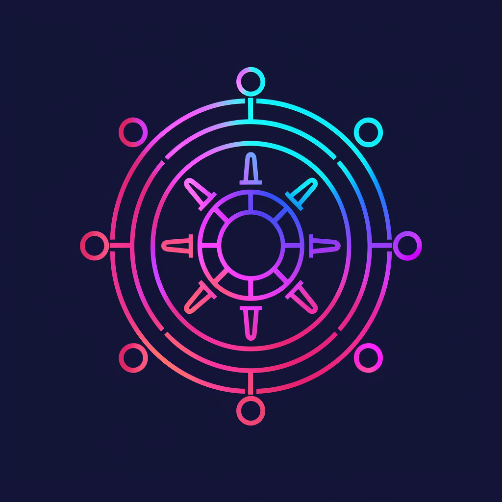

# Оркестрация контейнеров



Оркестрация контейнеров — это процесс автоматического развертывания, управления, масштабирования и взаимодействия контейнеризированных приложений. Контейнеры — это легковесные, переносимые и самодостаточные пакеты, которые включают в себя все необходимое для запуска приложения, включая код, библиотеки и зависимости.

## Kubernetes

Технологический прогресс в сфере информационных технологий непрерывно развивается, привнося значительные изменения в методы управления и масштабирования инфраструктуры. В 2014 году компания Google осуществила стратегический шаг, открыв исходный код проекта Kubernetes, который вбирает в себя лучшие элементы из внутренних систем компании, Borg и Omega. В то время Kubernetes был известен лишь ограниченному кругу специалистов. Однако по прошествии семи лет этот проект превратился в один из самых успешных open-source решений, широко применяемых в глобальном масштабе. В настоящее время Kubernetes (K8S) интегрирован в инфраструктуры множества компаний, варьирующихся от небольших стартапов до крупных облачных провайдеров, обеспечивая надежность и доступность их сервисов.

Слово “Kubernetes” происходит от древнегреческого κυβερνήτης, что означает капитан, рулевой, пилот; тот, кто управляет. В сокращении “K8S” цифра 8 - это восемь букв между K и S. Это платформа с открытым исходным кодом для развертывания, масштабирования, управления и контроля контейнеризованных приложений либо сервисов.

Kubernetes делает следующее:

* Управляет и запускает контейнеры

* Балансирует сетевой трафик между узлами кластера Kubernetes и количеством реплик контейнеров

* Осуществляет контроль состояния, автоматические развертывания и откаты реплик контейнеров внутри узлов кластера Kubernetes

* Осуществляет распределение нагрузки между узлами кластера Kubernetes

* Предоставляет автоматическое монтирование систем хранения для контейнеров

* Предоставляет декларативный API и CLI для управления

* И еще множество полезных, и не очень, модулей и сервисов, которые можно развернуть для управления автоматизацией, инфраструктурой и контейнерами

Kubernetes не делает следующее:

* Не собирает контейнеры с исходным кодом вашего приложения или сервиса

* Не предоставляет процессы и решения непрерывной интеграции (CI)

* Не включает в себя решения и системы сбора журналов и метрик

* Не включает в себя решения и системы хранения данных

* Не включает в себя решения и системы хранения контейнеров (registry)

* Не включает в себя решения и системы от всех бед и болячек инфраструктуры

Kubernetes или K8S — это не просто система управления задачами.

В традиционных системах управления задачами процесс идет по шагам: сначала A, потом B, потом C.

Kubernetes работает по-другому: это набор независимых процессов, которые постоянно приводят текущее состояние к желаемому. Важно не то, как перейти от А к С, а то, что в итоге состояние будет таким, как нужно.

Кроме того, Kubernetes не требует централизованного контроля, что делает систему проще в использовании, мощнее, надежнее и масштабируемее.

Тем не менее, все предыдущие определения не объясняют, почему нужен Kubernetes.

Основная причина, почему технологические компании используют Kubernetes, — это гибкость в разработке приложений. Раньше приложения были как один большой кусок кода, все функции находились вместе в одном месте. Сборка проектов занимала много времени.

С появлением контейнеров и методологий, таких как DevOps, приложения стали модульными. Теперь каждую функцию можно представить отдельным сервисом. Это похоже на конструктор LEGO: из разных деталей складывается приложение. Каждую деталь можно достать для изменения и тестирования, а затем вернуть на место.

Главная идея — быстрее внедрять новые функции в уже работающие приложения.

## Компоненты кластера

Сам кластер состоит из мастер-нод и worker-нод

Worker nodes состоит из компонентов:

* kubelet - сервис или агент, который контролирует запуск компонентов (контейнеров) кластера

* kube-proxy - конфигурирует правила сети на узлах

Плоскость управления (Master nodes) управляет рабочими узлами и подами в кластере. Там располагаются компоненты, которые управляют узлами кластера и предоставляют доступ к API.

Control plane состоит из компонентов:

* kube-apiserver - предоставляет API кубера

* etcd - распределенное key-value хранилище для всех данных кластера. Необязательно располагается внутри мастера, может стоять как отдельный кластер

* kube-scheduler - планирует размещение подов на узлах кластера

* kube-controller-manager - запускает контроллеры

* kubelet - сервис или агент, который контролирует запуск основных компонентов (контейнеров) кластер

### Виды контроллеров

Deployments можно представить как менеджера проекта: он следит за тем, чтобы проект был выполнен в соответствии с планом, описанным в документации (манифесте), распределяет задания среди сотрудников (контролируя созданные и удаленные поды) и следит за тем, чтобы все было на своих местах (управляя ReplicaSet).

ReplicaSet - это как гарантийная служба в компании: она следит за тем, чтобы всегда было нужное количество рабочих (поды), чтобы обеспечить нормальный ход работы.

StatefulSets похожи на менеджера по работе с клиентами, который сохраняет всю информацию о клиенте (идентификаторы и состояние подов) и гарантирует, что со всеми клиентами будет работать постоянный сотрудник (поды с идентификаторами).

DaemonSet - это как техобслуживание в офисе: они гарантируют, что на каждом этаже (узел кластера) всегда будет присутствовать техработник (поды) для поддержания чистоты и исправности оборудования.

Jobs можно представить как управляющих временными проектами: они создают команды для выполнения конкретных задач, следят за их выполнением и повторяют попытку в случае неудачи до тех пор, пока задача не будет успешно завершена.

CronJob - это как менеджер по расписанию: он следит за тем, чтобы задачи запускались в строго определенное время, как например, ежедневная уборка в офисе в 6 утра (запуск Jobs по расписанию).

Для управления кластером kubernetes используется команда `kubectl`

Основные команды, которые используются чаще всего

### kubectl get

Команда `kubectl get [имя объекта] -n [Имя_пространства_имен]` используется для извлечения информации об объектах в кластере Kubernetes. Основной формат отображения данных — табличный, однако команда также позволяет получать представление объектов в формате YAML, что может быть полезно для более детального анализа их конфигурации. Важным аспектом применения данной команды является использование опции `-n`, которая задает конкретное пространство имен, в котором находятся искомые объекты. Это позволяет более точно и эффективно управлять ресурсами в пределах кластера.

    kubectl get services -n Имя_неймспейса - выводит все сервисы в пространстве имён

    kubectl get pods --all-namespaces - выводит все поды во всех пространств имён

    kubectl get pods -o wide - выводит все поды в текущем пространстве имён с подробностями в виде расширенной таблицы

    kubectl get pods -n Имя_неймспейса - выводит все поды в пространстве имён

### kubectl apply

Команда `kubectl apply -f [имя манифеста yaml]` используется для применения конфигурационных манифестов к кластеру Kubernetes. Эта команда управляет созданием и обновлением объектов в кластере, основываясь на описаниях, предоставленных в файлах формата YAML. В случае, если в манифесте отсутствует указание пространства имен, его можно задать с помощью опции `-n [Имя_пространства_имен]`. Это обеспечивает более точное управление развертыванием ресурсов в различных пространствах имен внутри кластера.

    kubectl apply -f ./my-manifest.yaml - создать ресурсы

    kubectl apply -f ./my1.yaml -f ./my2.yaml - создать ресурсы из нескольких файлов

    kubectl apply -f ./dir - создать ресурсы из всех файлов манифеста в директории

    kubectl apply -f https://K8S.io/manifest - создать ресурсы из URL-адреса

### Pods

Представьте себе, что под (Pod) — это вагончик на игровом аттракционе в парке развлечений. Каждый вагончик (под) может содержать один или больше пассажиров (контейнеров). Эти пассажиры могут делиться общей сумкой для пикника (общим хранилищем) и проводить время вместе, обсуждая маршруты поездки (сетевые ресурсы).

Когда парк начинает свою работу, у него есть расписание, которое определяет, какие вагончики должны быть запущены в движение (какие контейнеры должны быть запущены), сколько раз один и тот же маршрут для вагончика нужно проехать (количество экземпляров или реплик), какую максимальную скорость они могут развить (лимиты), и какие аттракционы они могут выбирать (подключаемые ресурсы).

Специальный сотрудник парка развлечений, подобный kube-scheduler, планирует, какой вагончик будет отправлен на какие рельсы (узлы кластера), чтобы избежать пробок и сбои в системе.

Другой сотрудник, аналогичный kubelet, находится на каждом участке аттракциона и отвечает за то, чтобы вагончик действительно отправился в путь, следуя всем предписаниям и правилам (запуск пода на рабочем узле кластера).

Таким образом, под — это ключевая единица работы в "парке" кластеров Kubernetes, которая поддерживает порядок и эффективное распределение ресурсов.

### Namespace

Представьте себе большой парк с аттракционами, который разделён на разные зоны: зона приключений, детская зона, и зона отдыха. Эти зоны — это аналоги пространств имен (Namespace) в Kubernetes.

Каждая зона в парке имеет свои собственные аттракционы и объекты, которые не мешают друг другу и могут быть управляемы отдельно. Например, громкая музыка и яркие цвета зоны приключений не будут отвлекать посетителей зоны отдыха, где царит спокойная атмосфера.

Каждая зона может иметь свои правила и ограничения: например, в детской зоне используются разные квоты на количество аттракционов или ресурсов, необходимых для их работы, чтобы соответствовать возрасту и интересам маленьких посетителей. Эти квоты аналогичны политике квот в пределах пространства имен.

Кроме того, каждая зона может иметь свои собственные сотрудники, которые обслуживают только определённую зону и не вмешиваются в дела других зон. Это напоминает модель управления доступом в пространстве имен, где права доступа выдаются только на определённую область.

Таким образом, пространство имен в Kubernetes действует так же, как и такие зоны в парке: оно помогает изолировать и управлять ресурсами и политиками, создавая разные виртуальные "парки" внутри одного большого пространства.

Существует три пространства имен по умолчанию

default — пространство имён по умолчанию для объектов без какого-либо другого пространства имён

kube-system — пространство имён для объектов, созданных Kubernetes. Там размещаются системные поды кластера

kube-public — создаваемое автоматически пространство имён, которое доступно для чтения всем пользователям (включая также неаутентифицированных пользователей)

### Создание собственных обьектов

Чтобы создать свой namespace, нам нужно передать его спецификацию или манифест в формате yaml.

В файле .yaml создаваемого объекта Kubernetes необходимо указать значения для следующих полей:

apiVersion — используемая для создания объекта версия API Kubernetes. Стоит отметить, что из версии к версии версии api могут меняться

kind — тип создаваемого объекта

metadata — данные, позволяющие идентифицировать объект (name, UID и необязательное поле namespace)

spec — требуемое состояние объекта

Опишем манифест в файле `test-namespace.yaml`

```yaml
apiVersion: v1
kind: Namespace
metadata:
name: test
```

Для создания обьекта используем команду

```bash
$ kubectl apply -f test-namespace.yaml
```

Для проверки результата используем `kubectl get`

```bash
$ kubectl get namespace
NAME          STATUS    AGE
default       Active    1d
kube-system   Active    1d
kube-public   Active    1d
test          Active    10s
```

Попробуем описать манифест для создания пода

```yaml
apiVersion: apps/v1
kind: Deployment
metadata:
  name: nginx
  labels:
    app: nginx
spec:
  replicas: 1
  selector:
    matchLabels:
      app: nginx
  template:
    metadata:
      labels:
        app: nginx
    spec:
      containers:
      - name: nginx
        image: nginx:latest
        ports:
        - containerPort: 80
```

Создадим сущность

```bash
$ kubectl apply -f hello.yaml
deployment.apps/nginx-hello created
```

Проверим, создался ли под

```bash
$ kubectl get pods -n test
NAME        READY   STATUS              RESTARTS   AGE
nginx-hello-75cc4f9fb7-rv556   1/1     Running            0          9s
```

Чтобы подключится к контейнеру, необходимо создать для него сервис, либо ingress контроллер. Данные сущности будут рассмотрены далее, пока можно воспользоваться пробросом портов

```bash
$ kubectl port-forward nginx-hello-75cc4f9fb7-rv556 30080:80 -n test
```

После этого можно зайти на `http://адресноды:3000` и убедится в работоспособности контейнера

## Сервисы

Сервисы в Kubernetes

Сервисы в Kubernetes — это объекты, которые позволяют управлять и организовывать доступ к различным приложениям, запущенным в кластере. По сути, сервисы предоставляют стабильные IP-адреса и DNS-имена для наборов подов, чтобы другие приложения и пользователи могли надежно к ним подключаться, независимо от того, на каких подах и узлах они работают.

Примеры сервисов:

1. ClusterIP:

    * Это тип сервиса по умолчанию, который предназначен для внутреннего использования в кластере. Он обеспечивает доступ к подсам только изнутри кластера.

```yaml
apiVersion: v1
kind: Service
metadata:
    name: my-clusterip-service
spec:
    selector:
    app: MyApp
    ports:
    - protocol: TCP
        port: 80
        targetPort: 80
    type: ClusterIP
```


2. NodePort:

    * Расширяет ClusterIP и позволяет также доступ извне кластера через фиксированный порт на каждом узле.

```yaml
apiVersion: v1
kind: Service
metadata:
    name: my-nodeport-service
spec:
    selector:
    app: MyApp
    ports:
    - protocol: TCP
        port: 80
        targetPort: 80
        nodePort: 30007
    type: NodePort
```

3. LoadBalancer:

    * Предназначен для разворачивания служб, доступных извне кластера, при этом автоматически создается балансировщик нагрузки в облачной инфраструктуре (например, AWS, GCP, Azure).

```yaml
apiVersion: v1
kind: Service
metadata:
    name: my-loadbalancer-service
spec:
    selector:
    app: MyApp
    ports:
    - protocol: TCP
        port: 80
        targetPort: 80
    type: LoadBalancer
```

### Ingress контроллеры

Ingress в Kubernetes — это компонент, который управляет внешним доступом к сервисам в кластере. Он позволяет маршрутизировать HTTP и HTTPS трафик к различным сервисам на основе правил, которые определяются в конфигурации Ingress. Это очень полезно, когда у вас есть несколько сервисов, и вы хотите, чтобы каждый из них был доступен по разным URL или доменным именам.

Проще говоря, Ingress работает как "дорожный полицейский", который направляет входящий трафик к правильным "дверям" (сервисам) в вашем кластере.

Конфигурация Ingress

Представьте, что у вас есть два сервиса: один обслуживает веб-сайт, а другой — API. Вы можете настроить Ingress так, чтобы запросы на example.com шли на сервис веб-сайта, а запросы на example.com/api шли на API сервис.

```yaml
apiVersion: networking.k8s.io/v1
kind: Ingress
metadata:
    name: example-ingress
spec:
    rules:
    - host: example.com
    http:
        paths:
        - path: /
        pathType: Prefix
        backend:
            service:
            name: website-service
            port:
                number: 80
        - path: /api
        pathType: Prefix
        backend:
            service:
            name: api-service
            port:
                number: 80
```

TLS (HTTPS) поддержка

Ingress может поддерживать HTTPS, используя TLS сертификаты. Это делается путем настройки секции tls в конфигурации Ingress:

```yaml
apiVersion: networking.k8s.io/v1
kind: Ingress
metadata:
    name: secure-ingress
spec:
    tls:
    - hosts:
    - example.com
    secretName: tls-secret
    rules:
    - host: example.com
    http:
        paths:
        - path: /
        pathType: Prefix
        backend:
            service:
            name: secure-service
            port:
                number: 443
```

Для создания секрета с сертификатами можно использовать команду

```bash
$ kubectl create secret tls tls-secret --cert=tls.crt --key=tls.key
```
