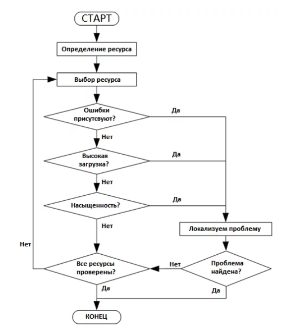

# Логирование и мониторинг

Мониторинг представляет собой процесс сбора и анализа данных, направленный на принятие обоснованных управленческих решений и достижение ключевых показателей успеха. На этом курсе мы погрузимся в ключевые аспекты мониторинга, обсудим, насколько глубоко стоит интегрировать этот процесс в работу различных команд, и рассмотрим основные методологии.

В рамках курса мы изучим концепцию Observability (наблюдаемость), которая включает в себя три ключевых компонента: мониторинг, логирование и трассировку. Все эти элементы играют важную роль в понимании внутреннего состояния систем.

Раскроем различия между этими компонентами:

1. Мониторинг — это процесс сбора, оцифровки и агрегации данных для поддержки принятия управленческих решений. Он помогает нам отслеживать ключевые показатели и выявлять отклонения от стандартов.

2. Логирование — работа с потоками событий (логами), которые фиксируют каждое важное действие в системе. Это больше связано с детальными записями произошедшего.

3. Трассировка — отслеживание процесса обмена данными между системами, например, через ServiceMesh или другими инструментами. Она помогает понять, как запросы перемещаются по системе.

Рассмотрим пример влияния мониторинга на управление базой данных. Когда пользователи сообщают о снижении производительности, мониторинг предоставляет статистику, такую как количество запросов в секунду и среднее время ответа. На основе этих данных мы можем принимать решения, например, оптимизировать запросы или изменять конфигурацию оборудования.

Во многих IT-системах, разработанных как "черный ящик", принятие решений основывается на неполной информации. Однако, мониторинг позволяет более осознанно подходить к управлению. Мы выделяем три ключевых направления для мониторинга:

1. Железо — аппаратные ресурсы, стоящие в основе любых облачных решений, требуют постоянного отслеживания загрузки и других параметров.

2. Инфраструктура — включает различные слои, такие как базы данных, очереди сообщений и другие сервисы. Для эффективного мониторинга важно учитывать метрики каждого из этих слоев.

3. Прикладные сервисы — разработки вашей команды, для которых вы сами определяете метрики. Важно, чтобы эти метрики были ясны и прозрачны для всех участников команды.

На этом курсе мы подробно изучим все аспекты наблюдаемости и научимся использовать их в вашей профессиональной деятельности для повышения эффективности работы систем.

Для начинающих разработчиков задачи по мониторингу могут казаться сложными из-за недостатка опыта и понимания, с чего начать. Чтобы сделать мониторинг более понятным, существуют три методики: USE, RED и The Four Golden Signals. Эти методики помогают определить, что именно следует отслеживать.

1. Методика USE

USE расшифровывается как Utilization (использование), Saturation (перегруженность) и Errors (ошибки). Она подходит для отслеживания ресурсов, которые могут быть исчерпаны, таких как оборудование. Рассмотрим примеры использования этой методики:

- Utilization (Использование): Например, для процессора интересны четыре показателя времени: 

  - idle: время, когда процессор простаивает.
  - iowait: время, когда процессор ожидает ввода-вывода.
  - system: время, потраченное на системные задачи.
  - user: время на пользовательские задачи.

- Saturation (Перегруженность): Показатель LA (LoadAverage) помогает понять, насколько загружена система. Если он больше, чем количество процессорных ядер, это значит, что задачи накапливаются.

- Errors (Ошибки): Например, ошибки кэша (cache misses) показывают, сколько раз процессор не смог получить данные из кэша.

Эти принципы можно применять не только к аппаратным ресурсам, но и к ресурсам приложения, таким как пулы соединений:

- Utilization: сколько соединений активно используется.
- Saturation: сколько запросов ожидают соединения.
- Errors: сколько раз не удалось установить соединение.

2. Методика RED

RED расшифровывается как Rate (скорость), Errors (ошибки) и Duration (длительность). Она хорошо подходит для приложений, работающих по принципу запроса и ответа:

- Rate (Скорость): количество запросов, обрабатываемых за единицу времени.
- Errors (Ошибки): количество неуспешных запросов за единицу времени.
- Duration (Длительность): как долго выполняются запросы. Часто отображают в виде гистограммы.

3. The Four Golden Signals

Эти четыре "золотых сигнала" помогают мониторить производительность, особенно на фронтенде:

- Latency (Задержка): время ответа на запрос. Важно учитывать задержки как успешных, так и неуспешных запросов.
  
- Traffic (Трафик): общий объем нагрузки на систему. Например, в веб-сервисах это может быть количество HTTP-запросов в секунду.
  
- Errors (Ошибки): процент запросов, завершившихся с ошибками.
  
- Saturation (Загруженность): насколько система приближается к своим пределам производительности. Важно понимать, что система может начать работать медленнее еще до полной загруженности.

Эти методики и сигналы помогают структурировать процесс мониторинга и четко понимать, какие аспекты системы важно отслеживать и оптимизировать.

## Универсальные метрики

Большую часть задач мониторинга можно решить одной-единственной метрикой — counter (монотонно растущий счетчик). С помощью этого счетчика можно посчитать очень много всего, например Rate — инкремент в секунду. Мы можем запросить его в любом нужном нам разрезе, с разными условиями.

Еще одна замечательная черта этой метрики: ее можно складывать между разными инстансами в кластере. Да и гистограмма времени по сути также представляет собой монотонно растущий счетчик. В целом 90% задач мониторинга можно решить с помощью монотонно растущего счетчика. И тегов, разумеется.

Другая универсальная метрика — это gauge, значение в моменте. Этот вариант больше подходит для бизнес-метрик и значений из БД. Gauge — очень агрегированная метрика, ее трудно делить на теги, поэтому нужно использовать ее очень аккуратно, при одинаковых значениях у всех экземпляров в кластере (например, количества записей в БД).

Gauge решает те 10% задач мониторинга, которые не решает counter. Например, через gauge можно выводить текущий размер какой-либо очереди, а с помощью counter тем временем — количество прочитанных и записанных в этой очереди сообщений. Этого набора будет достаточно для мониторинга любой очереди. Аналогично мы можем мониторить жизненный цикл любых бизнес-процессов.

При мониторинге систем часто забывают о фоновый процессах, которые тоже нужно отслеживать. Например, метрики для HTTP-запросов можно получить из таких инструментов, как nginx, но для мониторинга задач, специфичных для вашего приложения, придется создавать метрики самостоятельно. В некоторых случаях полезными могут быть готовые решения, такие как Quartz для задач.

Когда речь идет о бизнес-процессах, например, заявках с различными статусами, не стоит создавать метрики для каждой комбинации типов и статусов. Если у вас, например, 20 типов заявок и 30 статусов, вместо создания 600 метрик лучше использовать инкрементные счетчики для отслеживания изменений статусов заявок. Это поможет собрать данные для всех нужных отчетов без лишней работы.

Важно также следить за всеми внешними вызовами:

- Время ответа подрядчиков: как долго длится ответ на наши запросы.
- Количество запросов: сколько запросов было отправлено.
- Ошибки: сколько из этих запросов завершилось ошибкой.

Без этих данных вам придется постоянно копаться в логах. Не забывайте и о размерах очередей, о которых мы уже говорили.

При настройке мониторинга не стоит изобретать велосипед — часто нужные инструменты уже существуют и бесплатны. Например, Kafka поддерживает мониторинг "из коробки". HTTP-серверы и их клиенты тоже могут экспортировать метрики — просто подключите это и настройте вывод. То же самое применимо и к фоновым процессам.

## ПО Для мониторинга

Grafana — универсальная обертка для работы с аналитическими данными, которые хранятся в разных источниках. Она сама ничего не хранит и не собирает, а является лишь универсальным клиентом для систем хранения метрик. Например, с помощью нее можно ходить за цифрами как в традиционную базу PostgreSQL, так и в специализированные аналитические системы типа Prometheus.

Prometheus — Система сбора данных временных рядов, разработанная музыкальной компанией SoundCloud для решения внутренних потребностей в быстрой и гибкой обработке продуктовых метрик. Продукт с задачей справился настолько хорошо, что был выпущен за границы SoundCloud и теперь доступен как opensource для всех желающих.

Zabbix — свободная система мониторинга и отслеживания статусов разнообразных сервисов компьютерной сети, серверов и сетевого оборудования, написанная Алексеем Владышевым.

Nagios — программа с открытым кодом, предназначенная для мониторинга компьютерных систем и сетей: наблюдения, контроля состояния вычислительных узлов и служб, оповещения администратора в том случае, если какие-то из служб прекращают свою работу.
