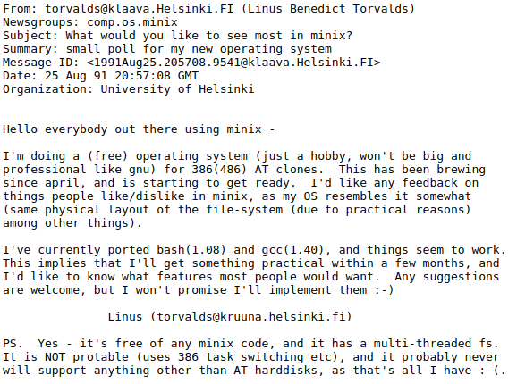
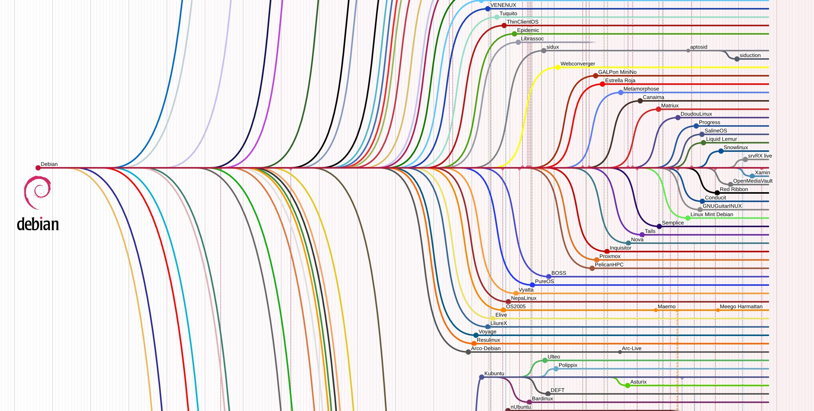

# Linux


Когда-то давно пользователи операционных систем на базе ядра Linux считались исследователями и энтузиастами, в народе их называли красноглазиками. Люди не понимали, для чего нужно писать команды в командной строке, если есть Windows с ее прекрасным графическим интерфейсом. Администраторы не понимали, зачем усложнять себе жизнь отказом от Microsoft, который кроме стабильного програмного обеспечения предоставляет поддержку и обновления, в пользу непонятно чего, распостраяемого непонятно кем. Мало того, что это OpenSource без конкретного разработчика, так еще и проблемы нужно самому решать. Когда-то давно никто не воспринимал Linux в серьез. Даже автор ядра Linux Линус Торвальдс писал, что это, скорее, фактультативный проект, чем какой-то серьезный, готовый к промышленной эксплуатации продукт.

В современном мире операционные системы на базе ядра Linux захватили значительную долю рынка информационных технологий и не только. Сейчас Linux можно встретить как в серверах, так и в системах видеонаблюдения, городской инфраструктуре, автомобилях (ЭБУ и мультимедиа системы любого современного автомобиля работают на Linux), ракетах, которые запускают в космос, разводных мостах в Санкт-Петербурге. Перечислять можно до бесконечности. Как же так получилось, что Linux из любительского проекта стал серьезной операционной системой?

В данной главе речь пойдет о истории развития, мотивации создания и текущем состоянии Linux, а также о базовых аспектах работы в ОС на базе ядра Linux.

## История развития Linux

Linux, как проект, начался в 1991 году, когда Линус Торвальдс, студент из Финляндии, объявил в группе новостей Usenet comp.os.minix о создании новой операционной системы, которая изначально была экспериментом. Проект зародился как альтернатива системе Minix, используемой в образовательных целях.



Дословный перевод этого сообщения:

```text
От: torvalds@klaava.Helsinki.FI (Линус Бенедикт Торвальдс)
Группы новостей: comp.os.minix
Тема: Что бы вы хотели видеть в minix?
Резюме: небольшой опрос по моей новой операционной системе
Идентификатор сообщения: <1991Aug25.205708.9541@klaava.Helsinki.FI>
Дата: 25 августа 91 20:57:08 GMT
Организация: Хельсинкский университет

Всем, кто использует minix -

Я создаю (свободную) операционную систему (просто хобби, не будет большой и профессиональной) для клонов 386(486) AT. Она разрабатывается с апреля и скоро будет готова. Мне хотелось бы узнать ваше мнение о том, что нравится/не нравится в minix, поскольку моя ОС, в некотором роде, похожа на нее (по ряду причин моя ОС повторяет файловую систему minix).

В настоящее время у меня портированы bash(1.08) и gcc(1.40), и похоже, что все работает. Это означает, что я получу что-то работоспособное в течение нескольких месяцев, и мне хотелось бы знать, какие функции наиболее важны для пользователей. Любые предложения приветствуются, но я не обещаю, что все они будут реализованы :-)

Линус (torvalds@kruuna.helsinki.fi)

PS. Да - здесь нет кода minix, и файловая система многопоточная. Она НЕ переносима (использует переключение задач 386 и т.д.) и, вероятно, не будет поддерживать ничего, кроме AT-винчестеров, так как у меня ничего другого нет :-(
```

Free в данном контексте необходимо читать именно как "Свободная", а не бесплатная, так как в то время все существующие операционные системы были с закрытым исходным кодом. Это означало, что при необходимости внесения изменений в операционную систему (добавления софта, устранения неисправностей, улучшения каких-либо функций) было необходимо обращаться к поставщику операционной системы. Далеко не каждый поставщик операционной системы хотел развивать свою ОС в соответствии с требованиями пользователя. Идея Линуса была в создании свободной операционной системы, которая будет обладать любым функционалом и запускаться на любом железе. За счет возможности свободной доработки под свои нужды Linux и стал популярен.

- Версия 0.01 и версия 0.02 (сентябрь 1991 года): Первые выпуски Linux не были полнофункциональными и вряд ли сразу могли использоваться в практических целях за пределами экспериментов и изучения. Несмотря на это, они стали основой для последующего развития. Сам Торвальдс описал их как «просто набор исходных кодов».

- Версия 0.11 (декабрь 1991 года): Это была первая версия, которая могла компилироваться с использованием GCC (GNU Compiler Collection), что добавило гибкости и простой интеграции новых функций. Также в этой версии были включены базовые компоненты, обеспечивающие функциональность ядра: поддержка файловой системы и драйверов.

- Версия 0.12 (январь 1992 года): Эта версия была первой, выпущенной под лицензией GNU General Public License (GPL), что сыграло важную роль в будущем распространении ОС.

- Версия 0.95 (март 1992 года): В этой версии впервые появился пользовательский интерфейс более высокого уровня и многозадачность, что сделало систему пригодной для работы в более реальных приложениях и помогло привлечь больше пользователей.

- Версия 1.0 (март 1994 года): Этот выпуск ознаменовал собой зрелость ядра, включавшего в себя исправление множества ошибок, поддержку более широкого спектра оборудования и улучшенную файловую систему. Расширение функциональности шло параллельно с увеличением числа участников проекта.

Множество пользователей, а затем и крупных компаний взяли Linux за основу своих информационных систем, и это не удивительно, ведь:

1. За Linux не нужно платить.
2. Linux можно изменять под свои нужды, добавлять туда новые драйвера и ПО.
3. Из пользователей Linux довольно быстро собралось сообщество, которое начало разрабатывать собственное ПО и драйвера, появились форумы, на которых можно задать вопрос и получить ответ.
4. Разработчик прислушивается к сообществу и добавляет в ядро наиболее востребованные разработки.

Не смотря на все вышеперечисленные плюсы, у схемы распостранения "Собери сам" есть и очевидные минусы -- отсуствие профессиональной поддержки. Так как эту проблему нужно было решать -- быстро появились компании, такие как RedHat. Компания RedHat распостраняет свой дистрибьютив Linux абсолютно бесплатно, но требует денег за доступ к своему хранилищу пакетов, а также за поддержку.

Да, большинство дистрибьютивов Linux бесплатны, но концепция свободного програмного обеспечения не означает, что оно должно быть бесплатным. По этому среди Linux дистрибьютивов можно найти и такие, за которые нужно платить деньги. Как правило, такие дистрибьютивы распостраняются и поддерживаются крупными компаниями.

Linux примечателен своим сообществом и тем, как энтузиазм и сотрудничество способствовали его развитию.

- Прозрачность и открытый код: Публикация исходного кода Linux позволила тысячам разработчиков по всему миру участвовать в его доработке и улучшении. Благодаря модели открытого исходного кода, каждый мог внести свой вклад и улучшить систему.

- Платформа для экспериментов: Для многих студентов и программистов Linux стал платформой для обучения и экспериментов. Прямой доступ к ядру позволял легко вносить изменения и добавлять новые функции без значительных затрат.

- Социальные сети и группы: Сообщества, такие как Usenet и позже форумы и почтовые списки, сыграли ключевую роль в обмене идеями и помощи новичкам. Это способствовало выстраиванию культуры сотрудничества и поддержки.

- Поддержка бизнес-сектора: Появление компаний, таких как Red Hat и SUSE, которые начали предлагать коммерческую поддержку Linux, облегчило его внедрение в корпоративной среде и добавило доверия к проекту. Присутствие спонсоров помогло стабилизировать развитие и внедрить практические серверные решения.

- Программная свобода и философия: Идеалы свободы программного обеспечения, продвигаемые сообществом Linux, были привлекательны для многих разработчиков. Это дало возможность создавать ПО без корпоративных ограничений.

Комбинация технической открытости, свободного распространения и активного сообщества разработчиков и пользователей сделали Linux успешной и передовой платформой. Сообщество продолжает играть центральную роль в его развитии, внедряя инновации и поддерживая проект на передовых позициях в мире технологий.

## Обзор рынка дистрибьютивов

Сам по себе Linux -- ядро, а не операционная система. Ядро Linux имеет открытый исходный код, что дает возможность каждому настроить ядро под себя, включить туда собственные драйвера, файловые системы и так далее. Ядро Linux вместе с набором программ уже образуют операционную систему, но в мире пользователей Linux это принято называть "дистрибутив" (от англ. Distribute -- распостранять). В мире существует множество готовых дистрибутивов Linux, каждый из которых представляет собой ядро Linux, скомпилированное из исходных кодов с определенным набором модулей и драйверов + набор определенных программ.

Ниже представлена карта дистрибьютивов, образованных от Debian. Это лишь малая часть всех сущесвуютщих дистрибьютивов Linux.



Среди первых Linux дистрибьютивов важно отметить

- Slackware (1993): Один из первых и старейших дистрибутивов Linux, созданный Патриком Волкердингом. Slackware был ориентирован на простоту и стабильность, делая акцент на минимуме модификаций пакетов и предоставлении пользователю гораздо большей свободы в настройке системы. Он стал базой для многих последующих дистрибутивов и оказал значительное влияние на развитие Linux.

- Debian (1993): Проект был инициирован Яном Мердоком и быстро стал известен благодаря своей высокой степени организованности и ориентированности на принципы свободного программного обеспечения. Debian управлялся сообществом разработчиков, что обеспечивало его независимость и активное развитие. Его система управления пакетами (dpkg и APT) и строгая политика лицензий сделали его основой для многих производных дистрибутивов.

Из современных дистрибьютивов выделяют

- Ubuntu: Пожалуй, самый известный дистрибутив на базе Debian, Ubuntu фокусируется на простоте использования и распространяется с дружественным интерфейсом для настольных компьютеров. Он регулярно обновляется и поддерживается Canonical, что сделало его популярным выбором как для домашних пользователей, так и в корпоративной среде.

- Fedora: Официальный дистрибутив от компании Red Hat, используемый как тестовая платформа для технологий, которые позже внедряются в коммерческий RHEL. Fedora выделяется своей новаторской позицией, интегрируя последние версии программ и технологий.

- CentOS: Было бесплатной версией RHEL, предоставляя пользователям возможности и стабильность Red Hat без связанных коммерческих затрат. Недавно проект был смещен в сторону CentOS Stream, что несколько изменило его роль в экосистеме.

- Arch Linux: Это дистрибутив, который привлекает опытных пользователей благодаря своей философии минимализма и гибкости. Arch предлагает систему сборки с нуля, что позволяет пользователю полностью контролировать состав своей ОС.

- OpenSUSE: Поддерживается сообществом и компанией SUSE, OpenSUSE предлагает стабильный и в то же время надежный опыт. Помимо стабильной версии Leap, доступен открытый вариант с более своевременными обновлениями — Tumbleweed.

Кроме того, существуют и специализированные дистрибьютивы, такие как

- RHEL (Red Hat Enterprise Linux): Коммерческая версия Linux от компании Red Hat, нацеленная на предприятия, с акцентом на стабильность, безопасность и поддержку на уровне компании. Предоставляет длительный цикл поддержки и сертифицирован для работы с критически важным программным обеспечением.

- Kali Linux: Разработан Offensive Security и нацелен на специалистов по безопасности и тестирование на проникновение. Kali включает в себя целый набор инструментов для тестирования безопасности, что делает его идеальным выбором для пентестеров и исследователей.

- Alpine Linux: Этот дистрибутив известен своей легковесностью и безопасностью. Он часто применяется в контейнеризации, особенно в Docker, благодаря своей минималистичной базе и низким системным требованиям.

- Raspberry Pi OS (ранее Raspbian): Оптимизирован для работы с популярными одноплатными компьютерами Raspberry Pi и предоставляет пользователям стабильную платформу с поддержкой разнообразных проектов DIY и IoT-решений.

## Linux сегодня

На сегодняшний день Linux применяется почти в каждой сфере нашей жизни, вот лишь некоторые из них

1. Кинопроизводство и анимация: В индустрии кино Linux используется для работы с визуальными эффектами и анимацией. Многие студии, такие как Pixar и DreamWorks, используют Linux для рендеринга кадров и обработки графики. Программы для 3D-моделирования и рендеринга, такие как Maya и Blender, часто устанавливаются на рабочих станциях с Linux из-за преимуществ в производительности и стабильности, а также возможности адаптации системы под конкретные нужды студии.

2. Автомобильная индустрия: Системы на базе Linux применяются в современных автомобилях для управления информационно-развлекательными системами, навигацией и даже в системах помощи водителю. Automotive Grade Linux (AGL) является проектом, разработанным специально для использования в автомобилях, что позволяет автопроизводителям разрабатывать более настраиваемые и интегрированные решения в транспортных средствах.

3. Космические исследования: Linux находит свое применение в космической сфере, например, в спутниках и марсоходах. Примером может служить марсоход «Perseverance» NASA, который использует Linux для управления небольшим вертолетом «Ingenuity». Способность Linux работать в ограниченных условиях, открытость к модификациям и большое сообщество разработчиков делают ее идеальной платформой для инноваций в космических технологиях.

4. Ядерная энергетика: Коммерческое программное обеспечение для моделирования и управления ядерными реакторами также может работать на Linux. Поскольку для таких приложений критически важна стабильность и безопасность, Linux часто выбирается в качестве операционной системы. Это позволяет инженерам сосредоточиться на разработке безопасных и надежных решений, используя открытые и проверенные временем технологии.

5. 3D-печать: В 3D-печати Linux используется для управления самим процессом печати. Множество программного обеспечения для моделирования, подготовки и контроля принтеров, как, например, OctoPrint, разрабатывается и запускается на Linux. Доступность и возможность настройки операционной системы играют здесь ключевую роль.

6. Распределенные вычисления и научные исследования: Множество суперкомпьютеров и серверов для распределенных вычислений работают под управлением Linux. В научных исследованиях, где требуется обработка огромных массивов данных, таких как вычислительная биология, климатическое моделирование или астрономия, Linux предоставляет стабильную и надежную платформу, способную справиться с требуемыми задачами.

7. Виртуальная и дополненная реальность: Для разработки приложений виртуальной и дополненной реальности часто используется Linux благодаря ее возможности эффективной работы с 3D-графикой и мощных вычислительных способностей. Разработчики ценят возможность настройки операционной системы для получения максимально возможной производительности от аппаратного обеспечения.

## Почему не Windows?

### Архитектура и ядро

- Linux:
  - Основан на открытом исходном коде, ядро разработано Линусом Торвальдсом в 1991 году.
  - Пользователь может просматривать, модифицировать и распространять код благодаря лицензии GNU General Public License.
  - Linux является модульным и позволяет пользователям компоновать систему по своим нуждам.

- Windows:
  - Проприетарная операционная система, разработанная корпорацией Microsoft.
  - Исходный код закрыт для пользователей, изменений не допускается.
  - Архитектура Windows более монолитная, что обеспечивает стабильность, но ограничивает кастомизацию.

### Интерфейс и пользовательский опыт

- Linux:
  - Поддерживает множество графических оболочек (Desktop Environments), таких как GNOME, KDE, Xfce, что позволяет пользователю выбрать интерфейс по своему вкусу.
  - В разных дистрибутивах (Ubuntu, Fedora, Debian, CentOS и т.д.) интерфейс может заметно различаться.

- Windows:
  - Интерфейс более унифицированный, Microsoft проводит изменения в интерфейсе на уровне обновлений версий (например, крупные изменения с выходом Windows 10 и 11).
  - Ориентирован на простоту и удобство использования, особенно для начинающих пользователей.

### Управление пакетами и программное обеспечение

- Linux:
  - Использует системы управления пакетами, такие как APT для Debian-based систем (например, Ubuntu) и YUM/DNF для Red Hat-based систем (например, Fedora).
  - Программы и обновления устанавливаются через репозитории, что позволяет поддерживать систему актуальной и безопасной.

- Windows:
  - Установка программ чаще всего происходит через установочные файлы (.exe, .msi) или Windows Store.
  - Обновления системы и программ осуществляются через встроенный механизм системы обновления Windows Update.

### Безопасность

- Linux:
  - Изначально разработан с акцентом на многопользовательскую среду, имеет разделение прав доступа, что снижает вероятность вирусных атак.
  - Благодаря сообществу и прозрачности кода уязвимости обычно быстро исправляются.

- Windows:
  - Из-за популярности среди пользователей и коммерческого софта часто становится целью для вирусов.
  - Microsoft активно работает над улучшением безопасности, интегрировав антивирус Windows Defender и другие защитные механизмы в систему.

### Производительность и системные ресурсы

- Linux:
  - Легкость и оптимизация позволяют работать даже на устаревшем оборудовании. Популярен в серверных решениях из-за низкого потребления ресурсов.
  - Подходит для тонкой настройки производительности.

- Windows:
  - Часто требует мощное оборудование, особенно новые версии ОС.
  - Обеспечивает широкий функционал "из коробки", что может размазывать ресурсы, но последние версии работают на оптимизацию.

### Совместимость и поддержка оборудования

- Linux:
  - Хорошо поддерживает открытые драйверы, но с проприетарными могут возникать сложности.
  - Активное сообщество работает над поддержкой широкого спектра устройств.

- Windows:
  - Широкая поддержка драйверов от производителей, что обеспечивает совместимость с большим числом аппаратов и периферийных устройств.

### Стоимость

- Linux:
  - Бесплатная ОС, большинство дистрибутивов не требуют оплаты за использование.
  - Возможна покупка коммерческой поддержки для корпоративных решений, например, от Red Hat или SUSE.

- Windows:
  - Коммерческая лицензия, обычно платная, хотя Microsoft предлагает бесплатные и льготные условия для образовательного сектора или мелких устройств.
