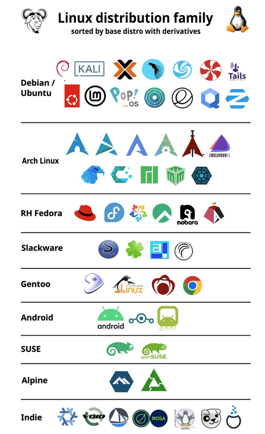

# Выбор дистрибьютива Linux

Существует огромное множество Linux дистрибьютивов, каждый из которых преследует свои цели и соблюдает свою идеологию:

RedHat-подобные дистрибьютивы предназначены для использования в организациях. Они отличаются наличием пакетного менеджера dnf и большим вниманием к тестированию пакетов. RedHat-подобные дистрибьютивы считаются наиболее стабильными.

Дистрибьютивы на основе Arch Linux уделяют особое внимание сообществу и кастомизации. Arch Linux и ему подобные предоставляют широкие возможности для сборки ядра и пакетов под конкретное железо, а также пользовательские репозитории. Чаще всего данные дистрибьютивы используют энтузиасты и исследователи.

Debian-подобные дистрибьютивы предназначены для использования обычными пользователями. Как правило, в Debian-подобных дистрибьютивах не самые новые, но наиболее стабильные пакеты, вокруг них собирается большое сообщество и, самое главное, в таких дистрибьютивах все максимально просто.

Существует спецаильный ресурс, на котором пользователи пишут обзоры на различные дистрибьютивы и оценивают их по различным параметрам. Ресурс называется [DistroWatch](https://distrowatch.com/). На данном ресурсе можно выполнить подбор дистрибьютива по параметрам, почитать на него обзоры и так далее.

## Рынок отечественных дистрибьютивов

Отечественные дистрибутивы операционных систем принято делить на пять основных категорий. Понимание этих категорий поможет лучше ориентироваться в актуальном состоянии отечественного ПО и его применении.

1. Вероятно Неподдерживаемые Продукты: Эта категория включает дистрибутивы, сайты которых уже не доступны и может отображаться заглушка с предложением о выкупе домена (например, ОСь и Альфа ОС). В некоторых случаях, сайт может быть активен, но информация о продукте отсутствует (как с Halo OS).

2. Нишевые Системы для Специфических Условий: Дистрибутивы, строго специализированные для работы в рамках жестко регулируемых ведомств и окружений, таких как защита государственной тайны.

3. Операционные Системы Не на Основании Linux: На текущий момент обнаружена одна такая система — Ульяновск.BSD. Разработка программного обеспечения для таких систем находится на начальной стадии, и поэтому экосистема ПО для BSD остается крайне ограниченной по сравнению с системами на базе Linux.

4. Альтернативные Пакетные Менеджеры: Дистрибутивы, которые используют пакетные менеджеры, отличные от более распространенных RPM и DEB. Ограниченность экосистемы ПО, поставляемого в бинарном формате именно в этих системах, делает их менее популярными. В эту категорию попадают Calculate Linux, основанный на Gentoo, и UBLinux, базирующийся на Arch Linux.

5. Ограниченная Доступность для Ознакомления: В эту категорию включен дистрибутив, который невозможно получить в виде ознакомительно-домашней версии через официальный сайт. Единственный пример здесь — ОС Лотос.

Популярные Отечественные Дистрибутивы для Корпоративного Использования

В рамках нашего курса мы рассмотрим наиболее популярные отечественные дистрибутивы, которые широко используются в крупных компаниях. Знание этих систем поможет вам лучше понимать текущие решения, применяемые в отечественной IT-инфраструктуре.

1. Astra Linux: Это сертифицированная операционная система с интегрированными средствами защиты информации (СЗИ), которая обеспечивает стабильную и безопасную работу IT-инфраструктур любого масштаба, а также обработку информации различной степени конфиденциальности. Astra Linux доступна в версиях для серверного, десктопного, мобильного и встраиваемого использования.

2. Alt Linux: Уникальная отечественная операционная система, которая не является клоном других дистрибутивов. Она выделяется своей свободной моделью распространения и rpm-совместимой пакетной базой. Alt Linux подходит для домашнего использования и образовательных целей.

3. RedOS: Этот дистрибутив является клоном CentOS с минимальными изменениями. Это делает его надежным выбором для тех, кто знаком с экосистемой CentOS.

Наш курс сосредоточен на работе с Astra Linux в силу ее широкого распространения на предприятиях различного уровня. Особый интерес представляет собственная экосистема Astra Linux, включая решение для организации доменных сред ALD Pro.

Поскольку Astra Linux основана на Debian, все особенности работы с debian-подобными операционными системами применимы и к ней.

Из особенностей AstraLinux важно отметить

* Собственный графический интерфейс Fly
* Эконсистему прикладного ПО
* Собственные средства безопасности, такие как мандатное разграничение доступа, hardend ядро, и так далее
* Стабильный канал обновлений системы и безопасности
