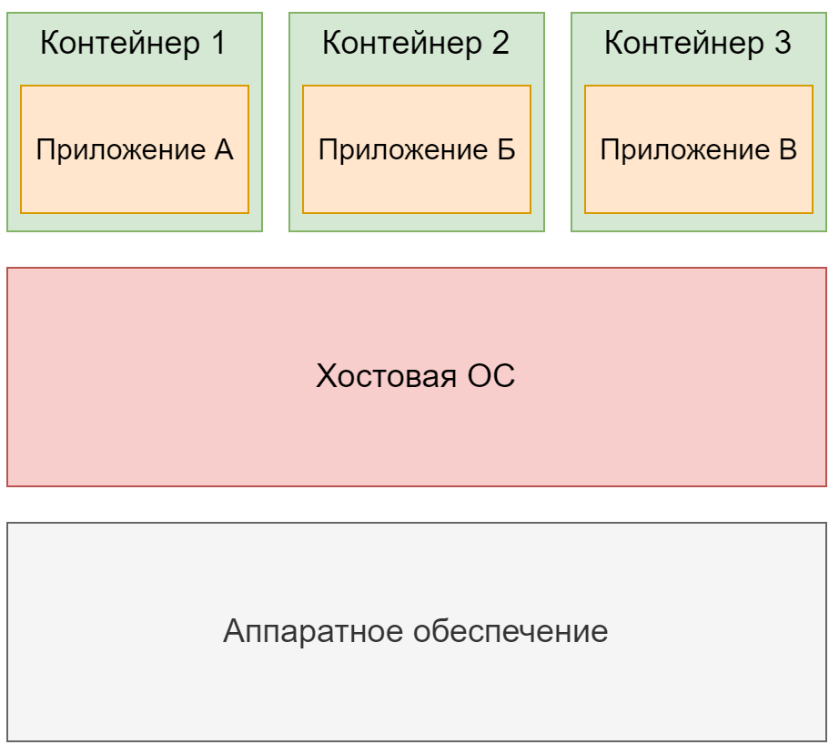

# Введение в контейнеризацию

Идея изоляции пользовательских пространств берет свое начало в 1979 году, когда в ядре UNIX появился системный вызов chroot. Он позволял изменить путь каталога корня / для группы процессов на новую локацию в файловой системе, то есть фактически создавал новый корневой каталог, который был изолирован от первого. Следующим шагом и логическим продолжением chroot стало создание в 2000 году FreeBSD jails («тюрем»), в которых изначально появилась частичная изоляция сетевых интерфейсов. В первой половине нулевых технологии виртуализации на уровне ОС активно развивались – появились Linux VServer (2001), Solaris Containers (2004) и OpenVZ (2005).

В операционной системе Linux технологии изоляции и виртуализации ресурсов вышли на новый этап в 2002 году, когда в ядро было добавлено первое пространство имен для изоляции файловой системы – mount. В 2006-2007 годах компанией Google был разработан механизм Process Containers (позднее переименованный в cgroups), который позволил ограничить и изолировать использование группой процессов ЦПУ, ОЗУ и др. аппаратных ресурсов. В 2008 году функционал cgroups был добавлен в ядро Linux. Достаточная функциональность для полной изоляции и безопасной работы контейнеров была завершена в 2013 году с добавлением в ядро пространства имен пользователей – user.

В 2008 году была представлена система LXC (LinuX Containers), которая позволила запускать несколько изолированных Linux систем (контейнеров) на одном сервере. LXC использовала для работы механизмы изоляции ядра – namespaces и cgroups. В 2013 году на свет появилась платформа Docker, невиданно популяризовавшая контейнерные технологии за счет простоты использования и широкого функционала. Изначально Docker использовал LXC для запуска контейнеров, однако позднее перешел на собственную библиотеку libcontainer, также завязанную на функционал ядра Linux. Наконец, в 2015 появился проект Open Container Initiative (OCI), который регламентирует и стандартизирует развитие контейнерных технологий по сей день.

## Что такое контейнеризация?



Контейнеризация (контейнерная виртуализация) – технология, которая позволяет запускать программное обеспечение в изолированных на уровне операционной системы пространствах. Контейнеры являются наиболее распространенной формой виртуализации на уровне ОС. С помощью контейнеров можно запустить несколько приложений на одном сервере (хостовой машине), изолируя их друг от друга.

Проще говоря, Контейнеризация – это как ящики для хранения вещей в вашем доме. Представьте, что у вас есть один большой шкаф, и вы хотите хранить в нём разные вещи: спортивный инвентарь, инструменты для ремонта, документы и кухонную утварь. Чтобы всё не смешалось и было проще найти нужное, вы помещаете эти вещи в отдельные ящики или контейнеры.

Каждый контейнер изолирован от других, но все они находятся в одном шкафу. Это значит, что если в одном контейнере что-то изменится или произойдёт, остальные остаются без изменений. В мире компьютеров контейнеризация позволяет запускать несколько приложений на одном сервере, не давая им вмешиваться в работу друг друга, как если бы они находились в отдельных ящиках.

Процесс, запущенный в контейнере, выполняется внутри операционной системы хостовой машины, но при этом он изолирован от остальных процессов. Для самого процесса это вылядит так, будто он единственный работает в системе.

## Как работает контейнеризация?

Контейнеры в Linux изолируют процессы, чтобы они не мешали друг другу и не использовали больше ресурсов, чем положено. Это достигается с помощью двух технологий ядра Linux: пространств имен (namespaces) и контрольных групп (cgroups).

Пространства имен позволяют каждому процессу "думать", что он работает в своей уникальной системе. Вот основные типы пространств имен:

- Файловая система (mount) – процесс видит только "свою" файловую систему.
- Сетевые (net) – процесс работает с "своими" сетевыми настройками и интерфейсами.
- Процессы (pid) – процессы видят и взаимодействуют только со "своими" процессами.
- Имена хоста (UTS) – каждый процесс может иметь своё имя хоста и доменное имя.
- Межпроцессное взаимодействие (ipc) – процессы могут обмениваться сигналами только внутри своего пространства.
- Пользователи (user) – процесс видит только "свои" идентификаторы пользователей и группы.

Каждый процесс работает в отдельном пространстве каждого из этих типов. Это похоже на то, как если бы у него была своя маленькая "виртуальная машина".

Контрольные группы берут на себя задачу управления ресурсами. Они устанавливают лимиты на то, сколько компьютерных ресурсов, таких как процессорное время, память или сетевое подключение, может использовать процесс. Это предотвращает ситуации, когда один процесс забирает слишком много ресурсов и мешает работать другим.

## Основные понятия

- `Container image (образ)` – файл, в который упаковано приложение и его среда. Он содержит файловую систему, которая будет доступна приложению, и другие метаданные (например команды, которые должны быть выполнены при запуске контейнера). Образы контейнеров состоят из слоев (как правило один слой – одна инструкция). Разные образы могут содержать одни и те же слои, поскольку каждый слой надстроен поверх другого образа, а два разных образа могут использовать один и тот же родительский образ в качестве основы. Образы хранятся в Registry Server (реестре) и версионируются с помощью tag (тегов). Если тег не указан, то по умолчанию используется latest. Примеры: Ubuntu, Postgres, NGINX.

- `Registry Server (реестр, хранилище)` – это репозиторий, в котором хранятся образы. После создания образа на локальном компьютере его можно отправить (push) в хранилище, а затем извлечь (pull) на другом компьютере и запустить его там. Существуют общедоступные и закрытые реестры образов. Примеры: Docker Hub (репозитории docker.io), RedHat Quay.io (репозитории quay.io).

- `Container (контейнер)` – это экземпляр образа контейнера. Выполняемый контейнер – это запущенный процесс, изолированный от других процессов на сервере и ограниченный выделенным объемом ресурсов (ЦПУ, ОЗУ, диска и др.). Выполняемый контейнер сохраняет все слои образа с доступом на чтение и формирует сверху свой исполняемый слой с доступом на запись.

- `Container Engine (движок контейнеризации)` – это программная платформа для упаковки, распространения и выполнения приложений, которая скачивает образы и с пользовательской точки зрения запускает контейнеры (на самом деле за создание и запуск контейнеров отвечает Container Runtime). Примеры: Docker, Podman.

- `Container Runtime (среда выполнения контейнеров)` – программный компонент для создания и запуска контейнеров. Примеры: runc (инструмент командной строки, основанный на упоминавшейся выше библиотеке libcontainer), crun.

- `Host (хост)` – сервер, на котором запущен Container Engine и выполняются контейнеры.

Представим, что образ контейнера – это как коробка с готовым обедом (т.е. приложением) и всеми необходимыми ингредиентами (т.е. средой), которые нужны для его приготовления (работы). Если нужно приготовить (запустить) еще один такой обед, то не нужно снова собирать все составляющие, вы просто используете готовую коробку.

Коробки с обедами (образы) хранятся в большом складе (реестре образов). Сначала вы готовите обед у себя на кухне (локальном компьютере), а затем отправляете его на склад, чтобы другие тоже могли получить доступ к вашей коробке и приготовить этот обед у себя.

Контейнер – это когда вы вытаскиваете коробку с обедом со склада, немного модифицируете её для своих нужд (добавляете слой изменений) и приступаете к ее использованию, не влияя на другие коробки, которые могут готовиться на той же кухне.

Движок контейнеров – это как шеф-повар, управляющий процессами на кухне (сервере). Он не сам готовит обеды, но точно знает, как правильно использовать коробки и ресурсы кухни. На деле, за сам процесс готовки отвечает конкретный повар - контейнерная среда выполнения.

А хост – это сама кухня, где происходит все движение: от доставки коробок до конкретного приготовления блюд.

## Какие бывают движки контейнеризации

### Docker

Docker — это платформа контейнеризации, использующая технологию контейнеров для упрощения разработки, тестирования и развертывания приложений. Docker позволяет упаковывать приложение и его зависимости в стандартный контейнер, который можно переносить между различными средами и операционными системами.

Основные компоненты:

- Docker Engine: Серверное приложение для запуска контейнеров. Он состоит из двух основных элементов: Docker Daemon (dockerd) и Docker CLI (docker).
- Образы: Шаблоны для создания контейнеров. Они определяются файлами Dockerfile.
- Контейнеры: Исполняемое приложение, которое запускается на основе образа.
- Docker Hub: Облачный сервис для хранения и обмена Docker-образами.

### Podman

Podman — это альтернатива Docker, ориентированная на безопасность и использование контейнеров без демона. Он базируется на модели запусков процессов пользователей, что исключает необходимость постоянно работающего или привилегированного процесса демона.

Основные особенности:

- Без демона: Позволяет запускать контейнеры без фонового сервиса.
- Rootless-контейнеры: Возможность работы с контейнерами без прав суперпользователя.
- Совместимость с Docker: Podman поддерживает Docker CLI-команды, что делает его легким в переходе для пользователей Docker.

### LXC

LXC — это технология контейнеризации на уровне операционной системы, которая использует функции ядра Linux для изоляции процессов. Она предоставляет все характеристики полноценной виртуализации без накладных расходов, присущих виртуальным машинам.

Основные особенности:

- Контейнеры LXC обеспечивают натуральную изоляцию на уровне процессов и сетей.
- Контейнеры могут быть намного ближе к полноценным виртуальным машинам по сравнению с более легкими контейнерами Docker.

Выбор движка контейнеризации зависит от целей, которых необходимо достичь и окружения, в котором предстоит работать. Данный курс сфокусирован на работе с docker, так как это самый популярный и простой в освоении движок контейнеризации.

## Работа с Docker

Работа с командной строкой чаще всего выглядит следующим образом

```bash
docker               container      stop
   ^                     ^           ^
   Команда docker        Сущность    Действие
```

В docker существует несколько сущностей:

- `container` -- базовая сущность. Для работы с контейнерами не обязательно указывать тип сущности, то есть допустимы такие команды как `docker run hello-world`, `docker ps` и так далее. Тип сущности указывать не обязательно
- `image` -- Сущность для работы с локальными образами. Команды для работы выглядят как `docker image ls`. Есть сокращения, например `docker images`.
- `volume` -- Сущность для работы с файловой системой контейнеров.
- `network` -- Сущность для работы с сетями
- `system` -- Сущность для работы с Docker Host

Команды, доступные для сущности container

    create — создание контейнера из образа.
    start — запуск существующего контейнера.
    run — создание контейнера и его запуск.
    ls — вывод списка работающих контейнеров.
    inspect — вывод подробной информации о контейнере.
    logs — вывод логов.
    stop — остановка работающего контейнера с отправкой главному процессу контейнера сигнала SIGTERM, и, через некоторое время, SIGKILL.
    kill — остановка работающего контейнера с отправкой главному процессу контейнера сигнала SIGKILL.
    rm — удаление остановленного контейнера.

Команды доступные для сущности image

    build — сборка образа.
    push — отправка образа в удалённый реестр.
    ls — вывод списка образов.
    history — вывод сведений о слоях образа.
    inspect — вывод подробной информации об образе, в том числе — сведений о слоях.
    rm — удаление образа.

Кроме того, docker поддерживает различные параметры, например `-p 80:80` для проброса портов из контейнера на хост, `-v` для монтирования томов, `-e` для установки переменных среды и так далее.

## Сборка образов

Для сборки образов контейнеров используются так называемые dockerfile

Dockerfile -- файл, в котором находится инструкция по сборке контейнера

```Dockerfile
FROM node:18-alpine # Имя базового образа
WORKDIR /app #Рабочая директория внутри контейнера
COPY . . #Копирование содержимого из текущей директории в контейнер
RUN yarn install --production # Запуск команды
CMD ["node", "src/index.js"] # Запуск приложения
EXPOSE 3000 # Открытие порта
```

Это пример простого Dockerfile, его хватит в большинстве случаев, однако Dockerfile поддерживает намного больше комманд

```Dockerfile
#FROM:
# Указывает базовый образ, на основе которого будет создан новый образ. Это должна быть первой инструкцией в каждом Dockerfile, за исключением случаев, когда используется аргументная инструкция ARG до нее.

FROM ubuntu:20.04

#MAINTAINER:
# Устаревшая инструкция для указания автора образа. Вместо нее рекомендуется использовать атрибуты на этапе LABEL.

MAINTAINER Your Name <youremail@example.com>

#LABEL:
# Задает метаданные для образа в формате пар "ключ-значение".

LABEL version="1.0" description="This is a sample image."

#RUN:
# Выполняет команду в слое поверх текущего образа и фиксирует результат. Используется для установки пакетов и выполнения других операций.

RUN apt-get update && apt-get install -y nginx

#CMD:
#Задает команду, которая будет выполнена при запуске контейнера. Может быть лишь одна инструкция CMD в Dockerfile (последняя используется, если их несколько).

CMD ["nginx", "-g", "daemon off;"]

#EXPOSE:
 #Информирует Docker о том, что контейнер слушает на указанных портах во время выполнения.

EXPOSE 80

#ENV:
#Устанавливает переменные окружения, которые будут доступны во время запуска контейнера.

ENV LANG=en_US.UTF-8

ADD:
#Копирует файлы или папки из контекста сборки или удаленного URL в файловую систему контейнера.
#Может автоматически распаковывать архивы.

ADD ./localfile /app/

#COPY:
#Копирует файлы или папки из контекста сборки в файловую систему контейнера.
#В отличие от ADD, не поддерживает извлечение из URL и распаковку архивов.

COPY ./localfile /app/

#ENTRYPOINT:
#Конфигурирует образ для использования как исполняемого файла. Позволяет установить команду, которая всегда будет исполняться для этого контейнера.

ENTRYPOINT ["python", "app.py"]

#VOLUME:
#Создает точку монтирования и определяет, что будет сохранено на хосте. Обеспечивает постоянство данных.

VOLUME /data

#USER:
#Определяет пользователя для выполнения команд в контейнере. Полезно для управления правами доступа.

USER www-data

#WORKDIR:
#Устанавливает рабочую директорию для выполнения следующих инструкций, таких как RUN, CMD, ENTRYPOINT, COPY, и ADD.

WORKDIR /app

#ARG:
#Определяет переменные, которые могут быть переданы на этапе сборки. Они могут использоваться с помощью флага --build-arg.

ARG VERSION=latest

#ONBUILD:
#Задает инструкции, которые будут выполнены, когда образ используется как базовый.

ONBUILD RUN echo "This runs on child build"

#STOPSIGNAL:
#Определяет системный сигнал, который будет использован для остановки контейнера.

STOPSIGNAL SIGTERM

#HEALTHCHECK:
#Указывает команду для проверки состояния запущенного контейнера. Позволяет определить, работает ли приложение должным образом.

HEALTHCHECK CMD curl --fail http://localhost:80/ || exit 1

#SHELL:
#Изменяет оболочку по умолчанию, используемую для выполнения команд в RUN.

SHELL ["powershell", "-Command"]
```

Для сборки образа достаточно выполнить команду `docker build`, находясь в директории с Dockerfile